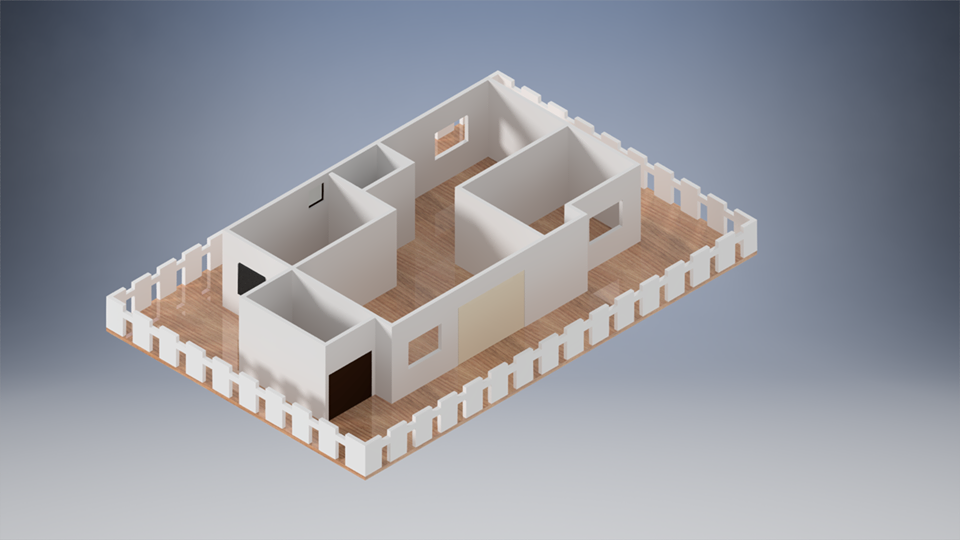

# 🏡 IoT Architecture and Communication Protocols for Smart Home System

This project showcases the design and implementation of a smart home system with real-time monitoring and control, using IoT architecture and standard communication protocols.

---

## 📌 Overview

The system is designed to:
- **Monitor** security, temperature, humidity, fire, gas leakage, and bathroom lights.
- **Control** home devices such as door locks, LED lights, fans/air conditioning systems, etc.
- **Display and control** device states through a web-based dashboard using the Blynk platform.

---

## 🧱 System Components

The smart home system is structured into 4 key modules:

### 1. Sensor Unit
- Collects real-time environmental data from:
  - **Temperature & Humidity sensors** (e.g., DHT11)
  - **Motion sensors** (e.g., HC-SR505)
  - **Gas sensors** (e.g., MQ6)
  - **Camera**
- Sends raw data to the microcontroller for processing.

### 2. Microcontroller Unit
- Acts as the brain of the system.
- Tasks:
  - Processes sensor data.
  - Sends data to the web server (Blynk).
  - Receives user control signals from the server.
  - Activates corresponding actuators (e.g., light ON/OFF, door open/close).

### 3. Web Server (Blynk)
- Visual interface for monitoring and control.
- Displays real-time data such as:
  - Security system state (enabled/disabled)
  - Temperature & humidity
- Enables remote control of devices over the internet.

### 4. Actuator Unit
- Executes control commands from the microcontroller.
- Devices include:
  - **LED lights**
  - **Servo motor** (for door control)
  - **Cooling/heating systems** (heater)
  - **Warning systems** (buzzer, alarm lights)

---

## 🌐 Communication Architecture

The system uses a layered communication structure:

| Layer         | Protocols Used      |
|---------------|---------------------|
| Device Layer  | GPIO, ADC, PWM      |
| Network Layer | Wi-Fi (ESP8266/ESP32) |
| App Layer     | Blynk HTTP/MQTT API |

---

## 🚀 Features

- 🔐 Security monitoring
- 🌡️ Temperature & humidity display
- 🚪 Remote door control (servo motor)
- 💡 Light automation and status monitoring
- 🔥 Fire and gas leak alerts
- 📲 Mobile app-based remote control (via Blynk)

---

## 📂 Project Structure
smart-home-iot/
│
├── firmware/ → ESP32 firmware code
├── docs/ → Architecture diagrams and documentation
├── server/ → (Optional) Web/MQTT server setup
├── images/ → Screenshots of the mobile interface
├── README.md → Project overview
└── .gitignore

---

## 📲 How to Run

### Hardware Requirements
- ESP32/ESP8266
- DHT11 (Temp/Humidity)
- MQ6 (Gas)
- HC-SR505 (Motion)
- H bridge 
- Relay, Servo, LED, Buzzer

### Software Requirements
- Arduino IDE / PlatformIO
- Blynk App (iOS/Android)
- Blynk Auth Token

### Steps

1. Upload the code in `firmware/` to your ESP32/8266.
2. Set up the Blynk app:
   - Add widgets (LEDs, gauges, buttons)
   - Configure virtual pins
3. Connect hardware components to the ESP32/8266.
4. Power the board and start monitoring via your phone.

---

## 📸 Screenshots

*(Optional: Add more interface pictures)*

---

